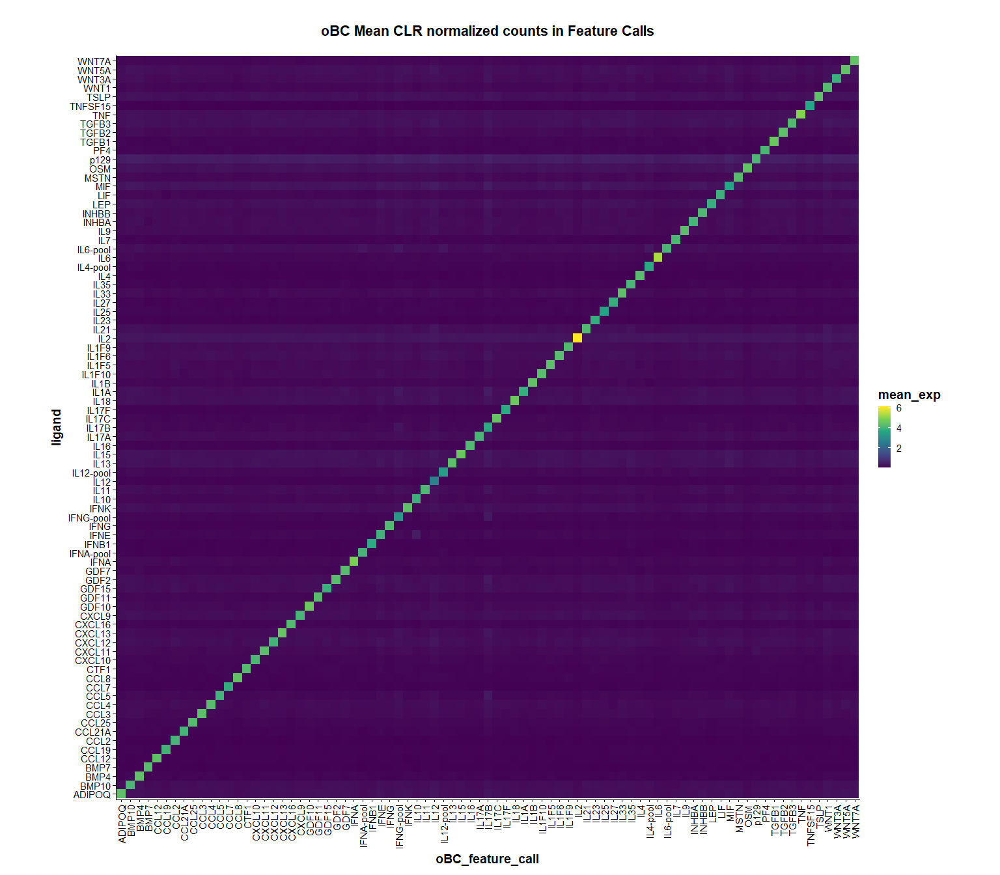
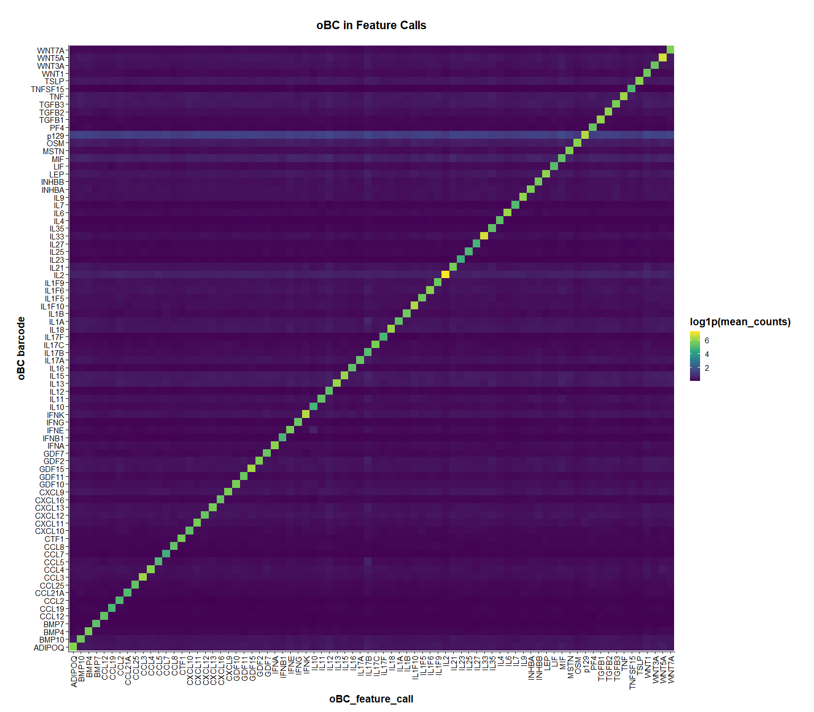
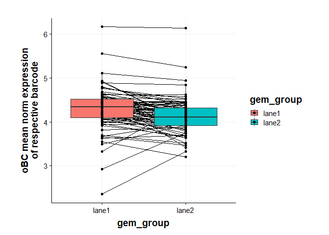

SIG04 DEG visualizations
================
Eric Y. Wang
2024-09-19

- [<u>Import data</u>](#import-data)
- [<u>Barcode Expression Heatmap</u>](#barcode-expression-heatmap)
- [<u>Barcode MFI correlations</u>](#barcode-mfi-correlations)

``` r
source("functions/plotting_fxns.R")
source("functions/scRNA_seq_analysis_functions.R")
theme_set(theme_Publication())
```

## <u>Import data</u>

``` r
# import seurat object and subset to singlets
data <- readRDS("C:/Users/Eric/Documents/datasets/EYW/SIG04_10x_240816/seurat_outs/SIG04_postqc_seurat.rds")
data <- subset(data, subset = oBC_classification == "singlet")
```

``` r
meta <- read_csv("processing_outs/plate_meta_SIG04.csv")
```

    ## Rows: 83 Columns: 4
    ## ── Column specification ────────────────────────────────────────────────────────
    ## Delimiter: ","
    ## chr (2): oBC_feature_call, row
    ## dbl (2): column, mBaojin_MFI_log10
    ## 
    ## ℹ Use `spec()` to retrieve the full column specification for this data.
    ## ℹ Specify the column types or set `show_col_types = FALSE` to quiet this message.

## <u>Barcode Expression Heatmap</u>

``` r
metadata <- data@meta.data %>%
  as_tibble(rownames = "cell_bc")

# extract CLR normalized counts and add feature call metadata
normCounts <- GetAssayData(data, assay = "oBC", layer = "data") %>%
  as_tibble(rownames = "ligand") %>%
  pivot_longer(-ligand, names_to = "cell_bc", values_to = "expression") %>%
  left_join(metadata, by="cell_bc")

# summarize mean expression
summaryCounts <- normCounts %>%
  group_by(oBC_feature_call, ligand) %>%
  summarise(mean_exp = mean(expression))
```

    ## `summarise()` has grouped output by 'oBC_feature_call'. You can override using
    ## the `.groups` argument.

``` r
summaryCounts %>%
  filter(!grepl("-pool",oBC_feature_call)) %>%
  filter(!grepl("-pool",ligand)) %>%
  ggplot(aes(x=oBC_feature_call,y=ligand,fill=mean_exp)) +
    geom_tile() +
    scale_fill_viridis_c() +
    ggtitle("oBC Mean CLR normalized counts in Feature Calls") +
    theme(aspect.ratio = 1,
          axis.text.x = element_text(angle = 90, vjust = 0.5, hjust=1))
```

<!-- -->

``` r
summaryCounts %>%
  ggplot(aes(x=oBC_feature_call,y=ligand,fill=mean_exp)) +
    geom_tile() +
    scale_fill_viridis_c() +
    ggtitle("oBC Mean CLR normalized counts in Feature Calls") +
    theme(aspect.ratio = 1,
          axis.text.x = element_text(angle = 90, vjust = 0.5, hjust=1))
```

<!-- -->

## <u>Barcode MFI correlations</u>

First, lets see if barcode counts correlate with mBaoJin MFI by flow. I
am mainly concerned with whether there is some independent assortment of
barcode containing virus and ligand displaying virus.

We’ll filter to only include cells from lane 1 because lane 2 was sorted
so it’s not really representative of raw MFI -\> barcode correlations

``` r
metadata <- data@meta.data %>%
  as_tibble(rownames = "cell_bc")

# extract CLR normalized counts and add feature call metadata
normCounts <- GetAssayData(data, assay = "oBC", layer = "data") %>%
  as_tibble(rownames = "ligand") %>%
  pivot_longer(-ligand, names_to = "cell_bc", values_to = "expression") %>%
  left_join(metadata, by="cell_bc")

# summarize mean expression
# filter by lane 1
summaryCounts <- normCounts %>%
  filter(gem_group == "lane1") %>%
  group_by(oBC_feature_call, ligand) %>%
  summarise(mean_exp = mean(expression),
            mean_log1p_umi = mean(oBC_log1p_total_counts))
```

    ## `summarise()` has grouped output by 'oBC_feature_call'. You can override using
    ## the `.groups` argument.

``` r
# join summary counts from above with MFI
# filter to only include matching feature_call ligand pairs
summaryCountsCalled <- summaryCounts %>%
  left_join(meta, by="oBC_feature_call") %>%
  filter(oBC_feature_call == ligand)
```

``` r
p1 <- summaryCountsCalled %>%
  ggplot(aes(x=mBaojin_MFI_log10,y=mean_exp)) +
    geom_point() +
    ylab("oBC mean norm expression\nof respective barcode") +
    theme(aspect.ratio = 1)

p2 <- summaryCountsCalled %>%
  ggplot(aes(x=mBaojin_MFI_log10,y=mean_exp)) +
    geom_point() +
    geom_text_repel(aes(label = oBC_feature_call)) +
    ylab("oBC mean norm expression\nof respective barcode") +
    theme(aspect.ratio = 1)

p1+p2
```

    ## Warning: Removed 5 rows containing missing values or values outside the scale range
    ## (`geom_point()`).
    ## Removed 5 rows containing missing values or values outside the scale range
    ## (`geom_point()`).

    ## Warning: Removed 5 rows containing missing values or values outside the scale range
    ## (`geom_text_repel()`).

    ## Warning: ggrepel: 59 unlabeled data points (too many overlaps). Consider
    ## increasing max.overlaps

<!-- -->

There’s a good trend with flow MFI and barcode detection. IL12 is kind
of an outlier which probably explains why I didn’t see anything in the
perturbation.

``` r
# summarize mean expression
# filter by lane 1
summaryCounts <- normCounts %>%
  group_by(gem_group, oBC_feature_call, ligand) %>%
  summarise(mean_exp = mean(expression))
```

    ## `summarise()` has grouped output by 'gem_group', 'oBC_feature_call'. You can
    ## override using the `.groups` argument.

``` r
# join summary counts from above with MFI
# filter to only include matching feature_call ligand pairs
summaryCountsCalled <- summaryCounts %>%
  left_join(meta, by="oBC_feature_call") %>%
  filter(oBC_feature_call == ligand)

summaryCountsCalled %>%
  ggplot(aes(x = gem_group, y = mean_exp, fill = gem_group)) +
    geom_line(aes(group = oBC_feature_call)) +
    geom_boxplot() +
    geom_point() +
    ylab("oBC mean norm expression\nof respective barcode") +
    theme(aspect.ratio = 1)
```

<!-- -->

As expected lane 2, which is flow sorted for mBaoJin+ cells has a
tighter distribution especially towards the bottom end. The
distributions are a bit shifted because the lane 2 amplification of oBC
was worse for some reason.
