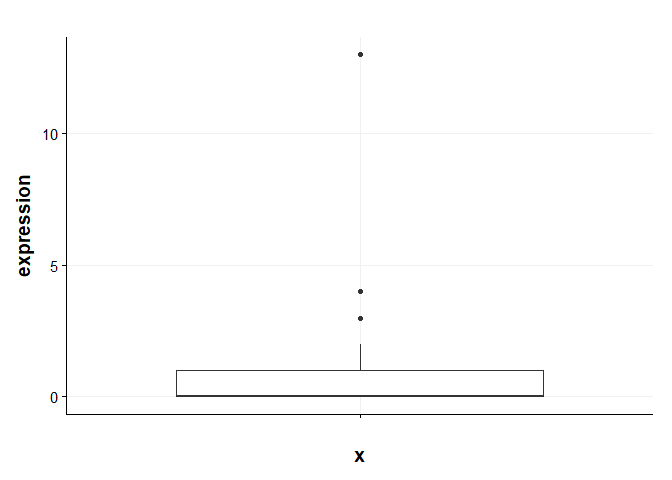
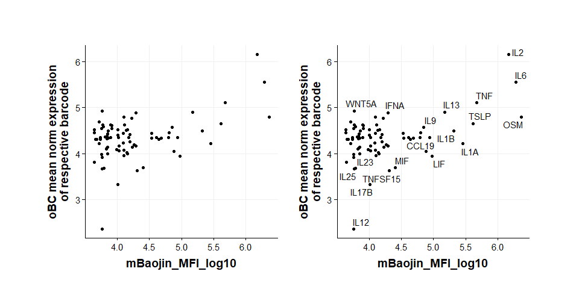
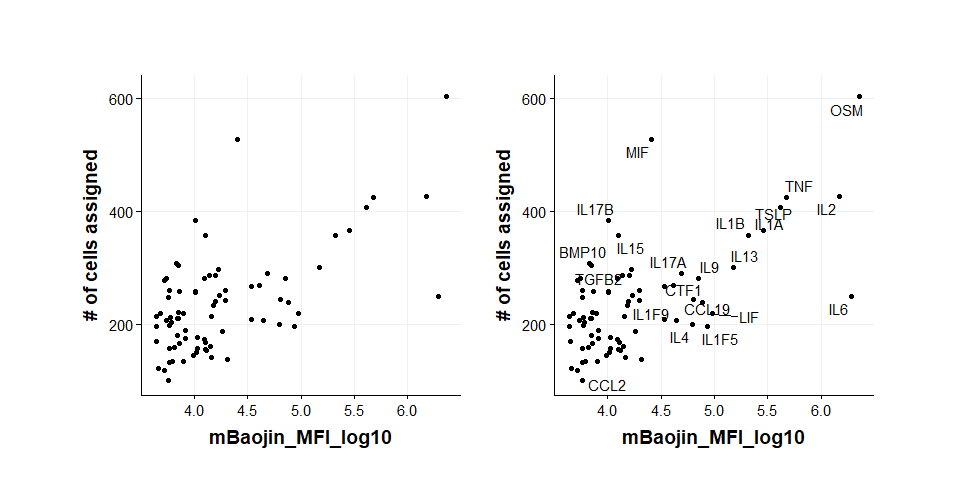

SIG04 DEG visualizations
================
Eric Y. Wang
2024-10-02

- [<u>Import dataSinglet</u>](#import-datasinglet)
- [<u>Background Barcode Expression</u>](#background-barcode-expression)
- [<u>Barcode Expression Heatmap
  (Singlets)</u>](#barcode-expression-heatmap-singlets)
- [<u>Barcode MFI correlations</u>](#barcode-mfi-correlations)
- [<u>Guide Call MFI correlations</u>](#guide-call-mfi-correlations)

``` r
source("functions/plotting_fxns.R")
source("functions/scRNA_seq_analysis_functions.R")
theme_set(theme_Publication())
```

## <u>Import dataSinglet</u>

``` r
# import seurat object and subset to singlets
data <- readRDS("C:/Users/Eric/Documents/datasets/EYW/SIG04_10x_240816/seurat_outs/SIG04_postqc_seurat.rds")
dataSinglet <- subset(data, subset = oBC_classification == "singlet")
```

``` r
meta <- read_csv("processing_outs/plate_meta_SIG04.csv")
```

    ## Rows: 83 Columns: 4
    ## ── Column specification ────────────────────────────────────────────────────────
    ## Delimiter: ","
    ## chr (2): oBC_feature_call, row
    ## dbl (2): column, mBaojin_MFI_log10
    ## 
    ## ℹ Use `spec()` to retrieve the full column specification for this data.
    ## ℹ Specify the column types or set `show_col_types = FALSE` to quiet this message.

## <u>Background Barcode Expression</u>

Here, I want to see if the CRISPR algorithm is undercalling barcodes.
I’ll take a look at the max BC count for cells that were not called by
the algorithm.

``` r
metadata <- data@meta.data %>%
  as_tibble(rownames = "cell_bc")

# extract raw umi counts and add feature call metadata
counts <- GetAssayData(data, assay = "oBC", layer = "counts") %>%
  as_tibble(rownames = "ligand") %>%
  pivot_longer(-ligand, names_to = "cell_bc", values_to = "expression") %>%
  left_join(metadata, by="cell_bc") %>%
  filter(gem_group == "lane1") %>%
  filter(oBC_classification == "none")

p1 <- counts %>%
  group_by(cell_bc) %>%
  summarise(max_counts = max(expression)) %>%
  ggplot(aes(x="",y=max_counts)) +
    geom_boxplot() +
    scale_y_continuous(breaks = seq(0,60,2), limits = c(0,56)) +
    ggtitle("Max BC count\nunclassified")

p2 <- counts %>%
  group_by(cell_bc) %>%
  filter(ligand != "p129") %>%
  summarise(max_counts = max(expression)) %>%
  ggplot(aes(x="",y=max_counts)) +
    geom_boxplot() +
    scale_y_continuous(breaks = seq(0,60,2), limits = c(0,56)) +
    ggtitle("Max BC count\nunclassified\nno p129")

p1+p2
```

<!-- -->

``` r
maxCounts <- counts %>%
  filter(ligand != "p129") %>%
  group_by(cell_bc) %>%
  summarise(max_counts = max(expression))

maxCounts
```

    ## # A tibble: 15,111 × 2
    ##    cell_bc                  max_counts
    ##    <chr>                         <dbl>
    ##  1 lane1_AAACCAAAGACATGCC-1          7
    ##  2 lane1_AAACCAAAGACCAGAG-1         11
    ##  3 lane1_AAACCAAAGAGGACCA-1          4
    ##  4 lane1_AAACCAAAGCAATTAC-1          3
    ##  5 lane1_AAACCAAAGGCAGGGT-1          4
    ##  6 lane1_AAACCAAAGGTAAGCG-1         17
    ##  7 lane1_AAACCAGCAAAGTGCA-1          6
    ##  8 lane1_AAACCATTCACTCCCA-1          3
    ##  9 lane1_AAACCATTCATAGCAT-1          3
    ## 10 lane1_AAACCATTCGCCATAA-1          3
    ## # ℹ 15,101 more rows

``` r
counts %>%
  filter(cell_bc == "lane1_AAAGTGGGTGGCAATT-1") %>%
  filter(ligand != "p129") %>%
  ggplot(aes(x="",y=expression)) +
    geom_boxplot()
```

<!-- -->

There are definitely some cells where a call could probably be made. I
think looking at the UMI cutoffs used by the some of the cells could be
called. Perhaps something to look into in the future.

## <u>Barcode Expression Heatmap (Singlets)</u>

``` r
metadata <- dataSinglet@meta.data %>%
  as_tibble(rownames = "cell_bc")

# extract CLR normalized counts and add feature call metadata
normCounts <- GetAssayData(dataSinglet, assay = "oBC", layer = "counts") %>%
  as_tibble(rownames = "ligand") %>%
  filter(grepl("-pool",ligand)) %>%
  pivot_longer(-ligand, names_to = "cell_bc", values_to = "expression") %>%
  left_join(metadata, by="cell_bc")

# summarize mean expression
summaryCounts <- normCounts %>%
  group_by(oBC_feature_call, ligand) %>%
  summarise(mean_counts = mean(expression))
```

    ## `summarise()` has grouped output by 'oBC_feature_call'. You can override using
    ## the `.groups` argument.

``` r
summaryCounts %>%
  ggplot(aes(x=oBC_feature_call,y=ligand,fill=log1p(mean_counts))) +
    geom_tile() +
    ylab("oBC barcode") +
    scale_fill_viridis_c() +
    ggtitle("oBC in Feature Calls") +
    theme(aspect.ratio = 1,
          axis.text.x = element_text(angle = 90, vjust = 0.5, hjust=1))
```

<!-- --> I think
these data do demonstrate viral carryover in the pool. You can see that
IL6-pool barcode is clearly enriched in each of the other -pool samples
but not in other samples. This shows that the enrichment isn’t just due
to chimeric amplicons but likely due to carryover of the virus during
pooling.

``` r
metadata <- dataSinglet@meta.data %>%
  as_tibble(rownames = "cell_bc")

# extract CLR normalized counts and add feature call metadata
normCounts <- GetAssayData(dataSinglet, assay = "oBC", layer = "counts") %>%
  as_tibble(rownames = "ligand") %>%
  filter(!grepl("-pool",ligand)) %>%
  pivot_longer(-ligand, names_to = "cell_bc", values_to = "expression") %>%
  left_join(metadata, by="cell_bc") %>%
  filter(!grepl("-pool",oBC_feature_call))

# summarize mean expression
summaryCounts <- normCounts %>%
  group_by(oBC_feature_call, ligand) %>%
  summarise(mean_counts = mean(expression))
```

    ## `summarise()` has grouped output by 'oBC_feature_call'. You can override using
    ## the `.groups` argument.

``` r
summaryCounts %>%
  ggplot(aes(x=oBC_feature_call,y=ligand,fill=log1p(mean_counts))) +
    geom_tile() +
    ylab("oBC barcode") +
    scale_fill_viridis_c() +
    ggtitle("oBC in Feature Calls") +
    theme(aspect.ratio = 1,
          axis.text.x = element_text(angle = 90, vjust = 0.5, hjust=1))
```

<!-- -->

## <u>Barcode MFI correlations</u>

First, lets see if barcode counts correlate with mBaoJin MFI by flow. I
am mainly concerned with whether there is some independent assortment of
barcode containing virus and ligand displaying virus.

We’ll filter to only include cells from lane 1 because lane 2 was sorted
so it’s not really representative of raw MFI -\> barcode correlations

``` r
metadata <- dataSinglet@meta.data %>%
  as_tibble(rownames = "cell_bc")

# extract CLR normalized counts and add feature call metadata
normCounts <- GetAssayData(dataSinglet, assay = "oBC", layer = "data") %>%
  as_tibble(rownames = "ligand") %>%
  pivot_longer(-ligand, names_to = "cell_bc", values_to = "expression") %>%
  left_join(metadata, by="cell_bc")

# summarize mean expression
# filter by lane 1
summaryCounts <- normCounts %>%
  filter(gem_group == "lane1") %>%
  group_by(oBC_feature_call, ligand) %>%
  summarise(mean_counts = mean(expression),
            mean_log1p_umi = mean(oBC_log1p_total_counts))
```

    ## `summarise()` has grouped output by 'oBC_feature_call'. You can override using
    ## the `.groups` argument.

``` r
# join summary counts from above with MFI
# filter to only include matching feature_call ligand pairs
summaryCountsCalled <- summaryCounts %>%
  left_join(meta, by="oBC_feature_call") %>%
  filter(oBC_feature_call == ligand)

p1 <- summaryCountsCalled %>%
  ggplot(aes(x=mBaojin_MFI_log10,y=mean_counts)) +
    geom_point() +
    ylab("oBC mean norm expression\nof respective barcode") +
    theme(aspect.ratio = 1)

p2 <- summaryCountsCalled %>%
  ggplot(aes(x=mBaojin_MFI_log10,y=mean_counts)) +
    geom_point() +
    geom_text_repel(aes(label = oBC_feature_call)) +
    ylab("oBC mean norm expression\nof respective barcode") +
    theme(aspect.ratio = 1)

p1+p2
```

    ## Warning: Removed 5 rows containing missing values or values outside the scale range
    ## (`geom_point()`).
    ## Removed 5 rows containing missing values or values outside the scale range
    ## (`geom_point()`).

    ## Warning: Removed 5 rows containing missing values or values outside the scale range
    ## (`geom_text_repel()`).

    ## Warning: ggrepel: 59 unlabeled data points (too many overlaps). Consider
    ## increasing max.overlaps

<!-- -->

There’s a good trend with flow MFI and barcode detection. IL12 is kind
of an outlier which maybe explains why I didn’t see anything in the
perturbation.

``` r
metadata <- dataSinglet@meta.data %>%
  as_tibble(rownames = "cell_bc")

# extract raw umi counts and add feature call metadata
counts <- GetAssayData(dataSinglet, assay = "oBC", layer = "counts") %>%
  as_tibble(rownames = "ligand") %>%
  pivot_longer(-ligand, names_to = "cell_bc", values_to = "counts") %>%
  left_join(metadata, by="cell_bc") %>%
  filter(gem_group == "lane1") %>%
  filter(oBC_feature_call == ligand) %>%
  left_join(meta, by="oBC_feature_call") %>%
  filter(!grepl("-pool",ligand))

ggplot(counts, aes(x=ligand,y=log1p(counts), fill = mBaojin_MFI_log10)) +
  geom_boxplot(outlier.shape = NA) +
  scale_fill_viridis_c() +
  theme(axis.text.x = element_text(angle = 90, vjust = 0.5, hjust=1)) +
  ggtitle("Distribution of approrpiate BC Counts in assigned cells")
```

<!-- -->

Another way to view it, but you can see that the

``` r
# summarize mean expression
# filter by lane 1
summaryCounts <- normCounts %>%
  group_by(gem_group) %>%
  mutate(mean_gem_group = mean(expression)) %>%
  group_by(gem_group, oBC_feature_call, ligand) %>%
  summarise(mean_exp = mean(expression),
            mean_norm_exp = mean(expression)-mean_gem_group)
```

    ## Warning: Returning more (or less) than 1 row per `summarise()` group was deprecated in
    ## dplyr 1.1.0.
    ## ℹ Please use `reframe()` instead.
    ## ℹ When switching from `summarise()` to `reframe()`, remember that `reframe()`
    ##   always returns an ungrouped data frame and adjust accordingly.
    ## Call `lifecycle::last_lifecycle_warnings()` to see where this warning was
    ## generated.

    ## `summarise()` has grouped output by 'gem_group', 'oBC_feature_call', 'ligand'.
    ## You can override using the `.groups` argument.

``` r
# join summary counts from above with MFI
# filter to only include matching feature_call ligand pairs
summaryCountsCalled <- summaryCounts %>%
  left_join(meta, by="oBC_feature_call") %>%
  filter(oBC_feature_call == ligand)

summaryCountsCalled %>%
  ggplot(aes(x = gem_group, y = mean_exp, fill = gem_group)) +
    geom_line(aes(group = oBC_feature_call)) +
    geom_boxplot() +
    geom_point() +
    ylab("oBC mean norm expression\nof respective barcode") +
    theme(aspect.ratio = 1)
```

<!-- -->

As expected lane 2, which is flow sorted for mBaoJin+ cells has a
tighter distribution especially towards the bottom end. *They’re not
that different though which is interesting (some level of independence
between display and viral uptake?)* The distributions are a bit shifted
because the lane 2 amplification of oBC was worse for some reason.

``` r
metadata <- dataSinglet@meta.data %>%
  as_tibble(rownames = "cell_bc")

# extract counts and add feature call metadata
normCounts <- GetAssayData(dataSinglet, assay = "oBC", layer = "counts") %>%
  as_tibble(rownames = "ligand") %>%
  pivot_longer(-ligand, names_to = "cell_bc", values_to = "expression") %>%
  left_join(metadata, by="cell_bc")

# summarize mean expression of background
# filter by lane 1
summaryCounts <- normCounts %>%
  filter(gem_group == "lane1") %>%
  filter(oBC_feature_call != ligand) %>%
  group_by(ligand) %>%
  summarise(mean_exp = mean(expression),
            mean_log1p_umi = mean(oBC_log1p_total_counts))%>%
  left_join(meta, by=c("ligand"="oBC_feature_call"))

p1 <- summaryCounts %>%
  filter(ligand != "p129") %>%
  ggplot(aes(x=mBaojin_MFI_log10,y=mean_exp)) +
    geom_point() +
    ylab("oBC mean counts\nbackground barcodes") +
    theme(aspect.ratio = 1)

p2 <- summaryCounts %>%
  filter(ligand != "p129") %>%
  ggplot(aes(x=mBaojin_MFI_log10,y=mean_exp)) +
    geom_point() +
    geom_text_repel(aes(label = ligand)) +
    ylab("oBC mean counts\nbackground barcodes") +
    theme(aspect.ratio = 1)

p3 <- summaryCounts %>%
  ggplot(aes(x=mBaojin_MFI_log10,y=mean_exp)) +
    geom_point() +
    geom_text_repel(aes(label = ligand)) +
    ylab("oBC mean counts\nbackground barcodes") +
    theme(aspect.ratio = 1)

p1+p2+p3
```

    ## Warning: Removed 5 rows containing missing values or values outside the scale range
    ## (`geom_point()`).
    ## Removed 5 rows containing missing values or values outside the scale range
    ## (`geom_point()`).

    ## Warning: Removed 5 rows containing missing values or values outside the scale range
    ## (`geom_text_repel()`).

    ## Warning: Removed 5 rows containing missing values or values outside the scale range
    ## (`geom_point()`).

    ## Warning: Removed 5 rows containing missing values or values outside the scale range
    ## (`geom_text_repel()`).

    ## Warning: ggrepel: 63 unlabeled data points (too many overlaps). Consider
    ## increasing max.overlaps

    ## Warning: ggrepel: 68 unlabeled data points (too many overlaps). Consider
    ## increasing max.overlaps

<!-- -->

``` r
metadata <- dataSinglet@meta.data %>%
  as_tibble(rownames = "cell_bc")

# extract raw umi counts and add feature call metadata
counts <- GetAssayData(dataSinglet, assay = "oBC", layer = "counts") %>%
  as_tibble(rownames = "ligand") %>%
  pivot_longer(-ligand, names_to = "cell_bc", values_to = "expression") %>%
  left_join(metadata, by="cell_bc") %>%
  filter(gem_group == "lane1") %>%
  filter(oBC_feature_call != ligand) %>%
  left_join(meta, by=c("ligand"="oBC_feature_call"))

p1 <- ggplot(counts, aes(x=ligand,y=expression, fill = mBaojin_MFI_log10)) +
  geom_boxplot() +
  #ylim(0,12)+
  scale_fill_viridis_c() +
  theme(axis.text.x = element_text(angle = 90, vjust = 0.5, hjust=1)) +
  ggtitle("Background Counts in Singlets")

p2 <- ggplot(counts, aes(x=ligand,y=expression, fill = mBaojin_MFI_log10)) +
  geom_boxplot(outlier.shape = NA) +
  ylim(0,12)+
  scale_fill_viridis_c() +
  theme(axis.text.x = element_text(angle = 90, vjust = 0.5, hjust=1)) +
  ggtitle("Background Counts in Singlets No Outliers")

p1/p2
```

    ## Warning: Removed 2890 rows containing non-finite outside the scale range
    ## (`stat_boxplot()`).

<!-- -->

## <u>Guide Call MFI correlations</u>

``` r
metadata <- dataSinglet@meta.data %>%
  as_tibble(rownames = "cell_bc")

# extract CLR normalized counts and add feature call metadata
normCounts <- GetAssayData(dataSinglet, assay = "oBC", layer = "data") %>%
  as_tibble(rownames = "ligand") %>%
  pivot_longer(-ligand, names_to = "cell_bc", values_to = "expression") %>%
  left_join(metadata, by="cell_bc")

# summarize mean expression
# filter by lane 1
summaryCounts <- normCounts %>%
  filter(gem_group == "lane1") %>%
  filter(oBC_feature_call == ligand) %>%
  group_by(oBC_feature_call) %>%
  summarise(n = n()) %>%
  left_join(meta, by="oBC_feature_call")

p1 <- summaryCounts %>%
  filter(oBC_feature_call != "p129") %>%
  ggplot(aes(x=mBaojin_MFI_log10,y=n)) +
    geom_point() +
    ylab("# of cells assigned") +
    theme(aspect.ratio = 1)

p2 <- summaryCounts %>%
  filter(oBC_feature_call != "p129") %>%
  ggplot(aes(x=mBaojin_MFI_log10,y=n)) +
    geom_point() +
    geom_text_repel(aes(label = oBC_feature_call)) +
    ylab("# of cells assigned") +
    theme(aspect.ratio = 1)

p1+p2
```

    ## Warning: Removed 5 rows containing missing values or values outside the scale range
    ## (`geom_point()`).
    ## Removed 5 rows containing missing values or values outside the scale range
    ## (`geom_point()`).

    ## Warning: Removed 5 rows containing missing values or values outside the scale range
    ## (`geom_text_repel()`).

    ## Warning: ggrepel: 55 unlabeled data points (too many overlaps). Consider
    ## increasing max.overlaps

<!-- --> Removed
p129 from the plots because it was added to the pool at a higher
frequency. Looking at Lane1 only
