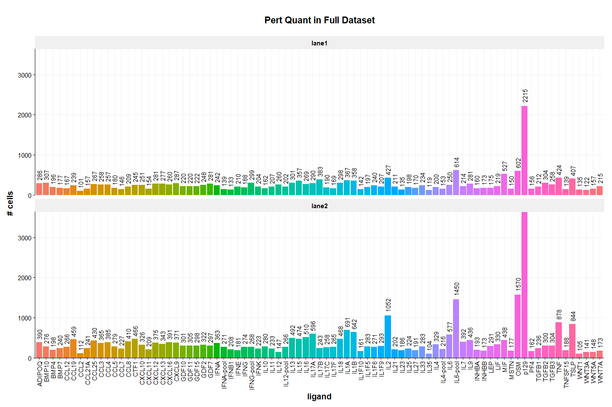

SIG04 DEG visualizations
================
Eric Y. Wang
2024-10-06

- [<u>Import data</u>](#import-data)
- [<u>Perturbation \# Quantification</u>](#perturbation--quantification)
- [<u>DEG Quantification</u>](#deg-quantification)
  - [DEG Numbers](#deg-numbers)
  - [DEG uniqueness](#deg-uniqueness)
- [<u>DEG Visualizations</u>](#deg-visualizations)

``` r
source("functions/plotting_fxns.R")
source("functions/scRNA_seq_analysis_functions.R")
theme_set(theme_Publication())
```

## <u>Import data</u>

``` r
degGem <- read_csv("analysis_outs/DEG_MAST_full_gem.csv")
```

    ## Rows: 331454 Columns: 8
    ## ── Column specification ────────────────────────────────────────────────────────
    ## Delimiter: ","
    ## chr (3): genes, comp_1, comp_2
    ## dbl (5): p_val, avg_log2FC, pct.1, pct.2, p_val_adj
    ## 
    ## ℹ Use `spec()` to retrieve the full column specification for this data.
    ## ℹ Specify the column types or set `show_col_types = FALSE` to quiet this message.

``` r
degFulloBCcov <- read_csv("analysis_outs/DEG_MAST_full.csv")
```

    ## Rows: 331454 Columns: 8
    ## ── Column specification ────────────────────────────────────────────────────────
    ## Delimiter: ","
    ## chr (3): genes, comp_1, comp_2
    ## dbl (5): p_val, avg_log2FC, pct.1, pct.2, p_val_adj
    ## 
    ## ℹ Use `spec()` to retrieve the full column specification for this data.
    ## ℹ Specify the column types or set `show_col_types = FALSE` to quiet this message.

``` r
degFullp139cov <- read_csv("analysis_outs/DEG_MAST_p139covariate_full.csv")
```

    ## Rows: 331454 Columns: 8
    ## ── Column specification ────────────────────────────────────────────────────────
    ## Delimiter: ","
    ## chr (3): genes, comp_1, comp_2
    ## dbl (5): p_val, avg_log2FC, pct.1, pct.2, p_val_adj
    ## 
    ## ℹ Use `spec()` to retrieve the full column specification for this data.
    ## ℹ Specify the column types or set `show_col_types = FALSE` to quiet this message.

``` r
degLane2 <- read_csv("analysis_outs/DEG_MAST_lane2.csv")
```

    ## Rows: 403515 Columns: 8
    ## ── Column specification ────────────────────────────────────────────────────────
    ## Delimiter: ","
    ## chr (3): genes, comp_1, comp_2
    ## dbl (5): p_val, avg_log2FC, pct.1, pct.2, p_val_adj
    ## 
    ## ℹ Use `spec()` to retrieve the full column specification for this data.
    ## ℹ Specify the column types or set `show_col_types = FALSE` to quiet this message.

``` r
# import seurat object and subset to singlets
data <- readRDS("C:/Users/Eric/Documents/datasets/EYW/SIG04_10x_240816/seurat_outs/SIG04_postqc_seurat.rds")
data <- subset(data, subset = oBC_classification == "singlet")
```

## <u>Perturbation \# Quantification</u>

``` r
pertNum <- data@meta.data %>%
  group_by(oBC_feature_call) %>%
  summarise(n = n())
pertNum
```

    ## # A tibble: 83 × 2
    ##    oBC_feature_call     n
    ##    <chr>            <int>
    ##  1 ADIPOQ             676
    ##  2 BMP10              583
    ##  3 BMP4               394
    ##  4 BMP7               417
    ##  5 CCL12              433
    ##  6 CCL19              698
    ##  7 CCL2               213
    ##  8 CCL21A             398
    ##  9 CCL25              697
    ## 10 CCL3               623
    ## # ℹ 73 more rows

p129 has 5857 cells in the full dataset

``` r
pertNum %>%
  ggplot(aes(x=oBC_feature_call,y=n,fill=oBC_feature_call)) +
    geom_bar(stat = "identity") +
    geom_text(aes(label=n), position=position_dodge(width=0.9), angle=90, vjust=0.5, hjust=-0.25) +
    scale_y_continuous(expand = c(0, 0)) +
    xlab("ligand") +
    ylab("# cells") +
    ggtitle("Pert Quant in Full Dataset") +
    theme(legend.position = "none",
          axis.text.x = element_text(angle = 90, vjust = 0.5, hjust=1))
```

<!-- -->

``` r
data@meta.data %>%
  group_by(oBC_feature_call,gem_group) %>%
  summarise(n = n()) %>%
  ggplot(aes(x=oBC_feature_call,y=n,fill=oBC_feature_call)) +
    geom_bar(stat = "identity") +
    geom_text(aes(label=n), position=position_dodge(width=0.9), angle=90, vjust=0.5, hjust=-0.25) +
    scale_y_continuous(expand = c(0, 0)) +
    facet_wrap(~gem_group, ncol = 1) +
    xlab("ligand") +
    ylab("# cells") +
    ggtitle("Pert Quant in Full Dataset") +
    theme(legend.position = "none",
          axis.text.x = element_text(angle = 90, vjust = 0.5, hjust=1))
```

    ## `summarise()` has grouped output by 'oBC_feature_call'. You can override using
    ## the `.groups` argument.

<!-- -->

## <u>DEG Quantification</u>

- quantify number of degs per ligand
- determine “uniqueness” of degs

### DEG Numbers

I’ll remove the pooled ligands for now since they’re not as relevant to
our question.

``` r
degFulloBCcov <- degFulloBCcov %>%
  filter(!grepl("-pool",comp_1))

degFullp139cov <- degFullp139cov %>%
  filter(!grepl("-pool",comp_1))

degGem <- degGem %>%
  filter(!grepl("-pool",comp_1))

degLane2 <- degLane2 %>%
  filter(!grepl("-pool",comp_1))
```

First, look at number of DEGs per ligand with different barcode
adjustments.

``` r
p1 <- degFulloBCcov %>%
  mutate(sig = ifelse(p_val_adj < 0.1,T,F)) %>%
  group_by(comp_1) %>%
  summarise(n = sum(sig)) %>%
  mutate(comp_1 = fct_reorder(comp_1,n)) %>%
  ggplot(aes(x=comp_1,y=n,fill=comp_1)) +
    geom_bar(stat = "identity") +
    geom_text(aes(label=n), position=position_dodge(width=0.9),angle=90, vjust=0.5, hjust=-0.25) +
    scale_y_continuous(expand = c(0, 0), limits = c(0,1500)) +
    xlab("ligand") +
    ylab("# DEG (p_adj < 0.1)") +
    ggtitle("DEG nCount oBC adjusted") +
    theme(legend.position = "none",
          axis.text.x = element_text(angle = 90, vjust = 0.5, hjust=1))

p2 <- degFullp139cov %>%
  mutate(sig = ifelse(p_val_adj < 0.1,T,F)) %>%
  group_by(comp_1) %>%
  summarise(n = sum(sig)) %>%
  mutate(comp_1 = fct_reorder(comp_1,n)) %>%
  ggplot(aes(x=comp_1,y=n,fill=comp_1)) +
    geom_bar(stat = "identity") +
    geom_text(aes(label=n), position=position_dodge(width=0.9),angle=90, vjust=0.5, hjust=-0.25) +
    scale_y_continuous(expand = c(0, 0), limits = c(0,1500)) +
    xlab("ligand") +
    ylab("# DEG (p_adj < 0.1)") +
    ggtitle("DEG p139 transcript adjusted") +
    theme(legend.position = "none",
          axis.text.x = element_text(angle = 90, vjust = 0.5, hjust=1))

p1/p2
```

<!-- -->

It’s interesting that there’s such a big difference between the two for
IL2. In general it seems like adjusting using p139 transcript (which is
much sparser than oBC) leads to decreased DEG identification. I’m not
sure exactly is this is more or less “correct” as it could be an
overcorrection. Perhaps IL2 is impacted in particular because there’s
more virus uptake?

``` r
p1 <- degGem %>%
  mutate(sig = ifelse(p_val_adj < 0.1,T,F)) %>%
  group_by(comp_1) %>%
  summarise(n = sum(sig)) %>%
  mutate(comp_1 = fct_rev(fct_reorder(comp_1,n))) %>%
  ggplot(aes(x=comp_1,y=n,fill=comp_1)) +
    geom_bar(stat = "identity") +
    geom_text(aes(label=n), position=position_dodge(width=0.9),angle=90, vjust=0.5, hjust=-0.25) +
    scale_y_continuous(expand = c(0, 0), limits = c(0,1500)) +
    xlab("ligand") +
    ylab("# DEG (p_adj < 0.1)") +
    ggtitle("DEG All") +
    theme(legend.position = "none",
          axis.text.x = element_text(angle = 90, vjust = 0.5, hjust=1))

p2 <- degLane2 %>%
  mutate(sig = ifelse(p_val_adj < 0.1,T,F)) %>%
  group_by(comp_1) %>%
  summarise(n = sum(sig)) %>%
  mutate(comp_1 = fct_rev(fct_reorder(comp_1,n))) %>%
  ggplot(aes(x=comp_1,y=n,fill=comp_1)) +
    geom_bar(stat = "identity") +
    geom_text(aes(label=n), position=position_dodge(width=0.9),angle=90, vjust=0.5, hjust=-0.25) +
    scale_y_continuous(expand = c(0, 0), limits = c(0,1500)) +
    xlab("ligand") +
    ylab("# DEG (p_adj < 0.1)") +
    ggtitle("DEG Lane 2") +
    theme(legend.position = "none",
          axis.text.x = element_text(angle = 90, vjust = 0.5, hjust=1))


p1/p2
```

<!-- -->

### DEG uniqueness

``` r
degGem %>%
  filter(p_val_adj < 0.1) %>%
  group_by(genes) %>%
  summarise(n = n()) %>%
  ggplot(aes(x=n)) +
    geom_histogram() +
    xlab("# of ligands in which DEG is present") +
    ggtitle("distribution of genes Full")
```

    ## `stat_bin()` using `bins = 30`. Pick better value with `binwidth`.

<!-- -->

``` r
degLane2 %>%
  filter(p_val_adj < 0.1) %>%
  group_by(genes) %>%
  summarise(n = n()) %>%
  ggplot(aes(x=n)) +
    geom_histogram() +
    xlab("# of ligands in which DEG is present") +
    ggtitle("distribution of genes Lane 2")
```

    ## `stat_bin()` using `bins = 30`. Pick better value with `binwidth`.

<!-- -->

``` r
# categorize genes by uniqueness
geneClass <- degGem %>%
  filter(p_val_adj < 0.1) %>%
  group_by(genes) %>%
  summarise(n_ligand = n()) %>%
  mutate(class = case_when(n_ligand == 1 ~ "unique",
                           n_ligand > 1 & n_ligand <=5 ~ "moderate (1-5)",
                           n_ligand > 5 & n_ligand <=10 ~ "high (5-10)",
                           n_ligand > 10 ~ "very high (10+)")) %>%
  mutate(class = factor(class, c("unique","moderate (1-5)","high (5-10)","very high (10+)")))

# categorize genes by uniqueness
geneClassLane2 <- degLane2 %>%
  filter(p_val_adj < 0.1) %>%
  group_by(genes) %>%
  summarise(n_ligand = n()) %>%
  mutate(class = case_when(n_ligand == 1 ~ "unique",
                           n_ligand > 1 & n_ligand <=5 ~ "moderate (1-5)",
                           n_ligand > 5 & n_ligand <=10 ~ "high (5-10)",
                           n_ligand > 10 ~ "very high (10+)")) %>%
  mutate(class = factor(class, c("unique","moderate (1-5)","high (5-10)","very high (10+)")))
```

``` r
degGemSig <- degGem %>%
  filter(p_val_adj < 0.1) %>%
  left_join(geneClass, by="genes")
write_csv(degGemSig,"analysis_outs/DEG_MAST_gem_sig_geneClass.csv")

degGemSigGenes <- degGem %>%
  filter(p_val_adj < 0.1) %>%
  left_join(geneClass, by="genes") %>%
  select(genes, n_ligand, class) %>%
  unique()
write_csv(degGemSig,"analysis_outs/DEG_MAST_gem_sig_geneClass_genes_only.csv")

degLane2Sig <- degLane2 %>%
  filter(p_val_adj < 0.1) %>%
  left_join(geneClassLane2, by="genes")
write_csv(degLane2Sig,"analysis_outs/DEG_MAST_lane2_sig_geneClass.csv")

degLane2SigGenes <- degLane2 %>%
  filter(p_val_adj < 0.1) %>%
  left_join(geneClass, by="genes") %>%
  select(genes, n_ligand, class) %>%
  unique()
write_csv(degGemSig,"analysis_outs/DEG_MAST_lane2_sig_geneClass_genes_only.csv")
```

``` r
# only pull out ligands with > 5 DEGs
ligands <- degGem %>%
  left_join(geneClass, by="genes") %>%
  mutate(sig = ifelse(p_val_adj < 0.1,T,F)) %>%
  group_by(comp_1) %>%
  summarise(n = sum(sig)) %>%
  filter(n > 5)

degGem %>%
  filter(comp_1 %in% ligands$comp_1) %>%
  filter(p_val_adj < 0.1) %>%
  left_join(geneClass, by="genes") %>%
  group_by(comp_1,class) %>%
  summarise(n = n()) %>%
  mutate(comp_1 = fct_reorder(comp_1,n)) %>%
  ggplot(aes(x=class,y=comp_1,fill=n)) +
    geom_tile() +
    geom_text(aes(label = n, color = ifelse(n > 500, "black", "white")),
            vjust = 0.5, hjust = 0.5, size = 3) +
    scale_fill_viridis_c() +
    scale_color_manual(values = c("black", "white"), guide = "none") +
    theme(axis.text.x = element_text(angle = 90, vjust = 0.5, hjust=1)) +
    ylab("ligand") +
    ylab("DEG class")
```

    ## `summarise()` has grouped output by 'comp_1'. You can override using the
    ## `.groups` argument.

<!-- -->

``` r
library(igraph)
```

    ## 
    ## Attaching package: 'igraph'

    ## The following object is masked from 'package:Seurat':
    ## 
    ##     components

    ## The following objects are masked from 'package:lubridate':
    ## 
    ##     %--%, union

    ## The following objects are masked from 'package:dplyr':
    ## 
    ##     as_data_frame, groups, union

    ## The following objects are masked from 'package:purrr':
    ## 
    ##     compose, simplify

    ## The following object is masked from 'package:tidyr':
    ## 
    ##     crossing

    ## The following object is masked from 'package:tibble':
    ## 
    ##     as_data_frame

    ## The following objects are masked from 'package:stats':
    ## 
    ##     decompose, spectrum

    ## The following object is masked from 'package:base':
    ## 
    ##     union

``` r
# only pull out ligands with > 5 DEGs
ligands <- degGem %>%
  left_join(geneClass, by="genes") %>%
  mutate(sig = ifelse(p_val_adj < 0.1,T,F)) %>%
  group_by(comp_1) %>%
  summarise(n = sum(sig)) %>%
  filter(n > 5)

# Assuming your tibble is called 'degs_tibble'
# Filter for significant DEGs
significant_degs <- degGem %>%
  filter(comp_1 %in% ligands$comp_1) %>%
  filter(p_val_adj < 0.1)
  

# Create a list of DEGs per ligand
ligand_gene_list <- significant_degs %>%
  group_by(comp_1) %>%
  summarize(genes = list(genes))

# Create a pairwise comparison of ligands based on the percentage of overlapping DEGs
edges <- combn(ligand_gene_list$comp_1, 2, function(pair) {
  ligand1 <- pair[1]
  ligand2 <- pair[2]
  
  # Get genes for each ligand
  genes1 <- ligand_gene_list %>% filter(comp_1 == ligand1) %>% pull(genes) %>% unlist()
  genes2 <- ligand_gene_list %>% filter(comp_1 == ligand2) %>% pull(genes) %>% unlist()
  
  # Calculate overlap and percentages
  overlap <- length(intersect(genes1, genes2))
  percentage_overlap <- overlap / min(length(genes1), length(genes2)) * 100  # Relative to smaller set
  
  if (overlap > 0) {
    return(data.frame(from = ligand1, to = ligand2, weight = percentage_overlap))
  } else {
    return(NULL)
  }
}, simplify = FALSE) %>%
  bind_rows()

# Create the igraph object
graph <- graph_from_data_frame(edges, directed = FALSE)

# Plot the graph using the force-directed layout
plot(graph, layout = layout.fruchterman.reingold, edge.width = E(graph)$weight*0.05, 
     vertex.label = V(graph)$name, vertex.size = 10, 
     main = "Force-Directed Layout: Overlapping DEGs Between Ligands\nPercentage of Total DEGs")
```

<!-- -->

A few interesting things to note from this. CXCL9/10/11 have differnt
signatures. CXCL9 is well connected to interferons while CXCL10/11 is
not (even though the canonically both signal through CXCR3). This is
well reflected in the DEGs.

## <u>DEG Visualizations</u>

``` r
# get list of significant DEGs with shorter name lol
degSig <- degGem %>%
  filter(p_val_adj < 0.1)
```

``` r
# subset data
dataSub <- subset(data, subset = oBC_feature_call %in% c("CXCL9","CXCL10","CXCL11","CXCL12","IFNA","p129") & gem_group == "lane2")
dataSub <- ScaleData(dataSub, features = rownames(dataSub))
```

    ## Centering and scaling data matrix

    ## Warning: Different features in new layer data than already exists for
    ## scale.data

``` r
# make heatmap with significant genes
genes <-  filter(degSig, comp_1 %in% c("CXCL9","CXCL10","CXCL11"))$genes %>% unique()
DoHeatmap(dataSub, features = genes, group.by = "oBC_feature_call")
```

<!-- -->

``` r
library(ggpointdensity)
test <- tibble(Ifi27l2a_counts = GetAssayData(dataSub, assay = "RNA", layer = "counts")["p139-T7oBC5p-MS2",],
               Ifi27l2a_scale = GetAssayData(dataSub, assay = "RNA", layer = "scale.data")["p139-T7oBC5p-MS2",],
               oBC_nCount = dataSub$oBC_log1p_total_counts,
               gem_group = dataSub$gem_group,
               feature_call = dataSub$oBC_feature_call)

test %>%
  filter(gem_group == "lane2") %>%
  ggplot(aes(x = Ifi27l2a_scale, y = oBC_nCount)) +
    geom_pointdensity() +
    geom_density_2d() +
    scale_color_viridis_c()
```

<!-- -->

``` r
VlnPlot(dataSub, c("Izumo1r","Ifi27l2a","Tap1","Stat1"), group.by = "oBC_feature_call", ncol = 2, pt.size = 0)
```

<!-- -->

``` r
# subset data
dataSub <- subset(data, subset = oBC_feature_call %in% c("GDF2","GDF11","p129") & gem_group == "lane2")
dataSub <- ScaleData(dataSub, features = rownames(dataSub))
```

    ## Centering and scaling data matrix

    ## Warning: Different features in new layer data than already exists for
    ## scale.data

``` r
# make heatmap with significant genes
genes <-  filter(degSig, comp_1 %in% c("GDF2","GDF11","p129"))$genes %>% unique()
DoHeatmap(dataSub, features = genes, group.by = "oBC_feature_call")
```

<!-- -->
